<div align="center">

<!-- hero: monochrome ASCII portrait, types in like a terminal.
     regenerate: python scripts/prep_photo.py <photo> && python scripts/make_ascii_svg.py -->

<h3><code>kaua-hiro ~ $ whoami</code></h3>


<br>
<br>

<!-- animated contribution graph: real data, boxes reveal cell by cell
     (regenerated daily by .github/workflows/update-profile-art.yml) -->

<h3><code>kaua-hiro ~ $ ./contributions.sh</code></h3>



<br>
<br>

<h3><code>kaua-hiro ~ $ ./links.sh</code></h3>

<p><b>FullStack Software Developer · Sistemas, APIs & Automação</b></p>

[](https://www.linkedin.com/in/kauamizumoto/)
[](https://github.com/kaua-hiro)
[](https://www.infojobs.com.br/curriculum/kaua-mizumoto)

<br>

</div>

<br/>

<!-- ===== QUEM SOU EU ===== -->
## 👨‍💻 Quem sou eu?

```typescript
const kaua: Developer = {
  nome:     "Kauã Hiro Mizumoto",
  idade:    21,
  cargo:    "FullStack Software Developer",
  formacao: "Desenvolvimento de Software Multiplataforma (Fatec)",
  foco:     "Sistemas, Integrações de APIs, Automações e Inteligência Artificial",
  stack: {
    linguagens:    ["TypeScript", "JavaScript", "Python"],
    frameworks_orm:["Next.js", "Prisma"],
    banco_dados:   ["PostgreSQL", "SQL Server", "MySQL"],
    ia:            ["RAG", "Automação com LLMs"],
  },
  missao:   "Entregar soluções escaláveis e eficientes em múltiplas plataformas 🚀",
};
```

<br/>

<!-- ===== SOBRE O TRABALHO ===== -->
## 🏗️ Sobre meu trabalho

- 🔗 **Integrações de APIs e Webhooks** — marketplaces (Dafiti, Plugg.to), API do Banco Central e automações via Discord
- 🤖 **Conciliação de dados e automação** — robôs para cruzamento automatizado de dados de ERPs (Linx x Qive) e distribuição de relatórios
- 🧠 **Inteligência Artificial** — assistentes corporativos com RAG consumindo documentação em PDF
- 🌐 **SaaS Full-Stack** — plataformas com Next.js, Prisma e PostgreSQL

<br/>

<!-- ===== STACK ===== -->
## 🛠️ Stack Tecnológica

<table>
<tr>
<td valign="top" width="58%">

**Linguagens**


**Frontend & Frameworks**


**Backend & Dados**


**Ferramentas & Cloud**


</td>
<td valign="middle" width="42%" align="center">


</td>
</tr>
</table>

<br/>

<!-- ===== CERTIFICAÇÕES ===== -->
## 🎓 Licenses & Certifications

<div align="center">


</div>

<sub>📚 Explore minha jornada profissional completa, certificações e recomendações no meu <a href="https://www.linkedin.com/in/kauamizumoto/">perfil do LinkedIn</a>.</sub>

<br/>

<!-- ===== CONTATO ===== -->
## 📫 Contato

<div align="center">

<a href="https://www.linkedin.com/in/kauamizumoto/">
  
</a>
<a href="https://www.infojobs.com.br/curriculum/kaua-mizumoto">
  
</a>
<a href="https://github.com/kaua-hiro">
  
</a>

</div>

<br/>

<!-- ===== STATS ===== -->
## 📊 GitHub Stats

<div align="center">


<br/>


</div>

<br/>

<!-- ===== ACTIVITY ===== -->
## 📈 Gráfico de Atividade

<div align="center">

</div>

---

<div align="center"><sub>kaua-hiro</sub></div>
